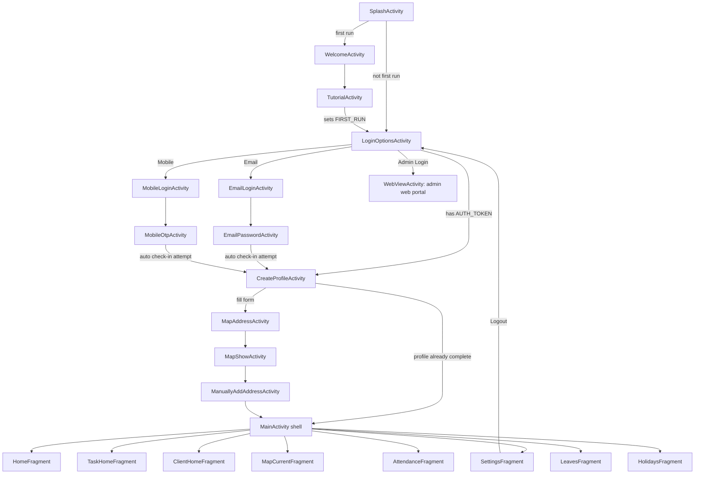
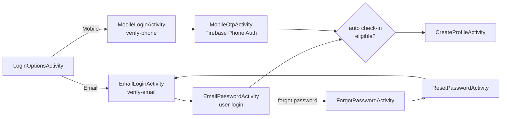
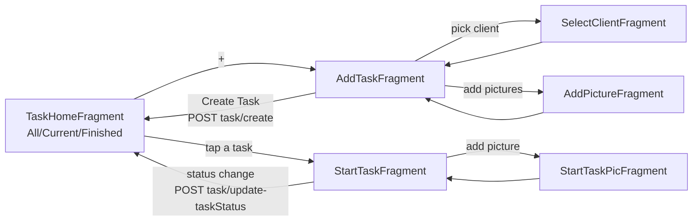

# EmpMonitor Android App — Flow Documentation

Package: `com.empcloud.empmonitor` · DI: Hilt (`BaseApplication`) · Networking: Retrofit + `NetworkRepository` · Realtime: Socket.IO · Background: `WorkManager` + `AlarmManager` + a foreground `LocationService`.

Navigation in this app is **not** driven by the Jetpack Navigation component — there is no `nav_graph.xml`. Every screen transition is a manual `startActivity(Intent(...))` or a `FragmentManager` `replace()` (via a shared `switchFragment()` helper) inside a single-`FragmentContainerView` shell (`MainActivity`).

## Table of contents

1. [High-level flow](#1-high-level-flow)
2. [App entry & manifest](#2-app-entry--manifest)
3. [Splash & onboarding](#3-splash--onboarding)
4. [Login](#4-login)
5. [Profile creation](#5-profile-creation)
6. [Main app shell](#6-main-app-shell)
7. [Home / check-in-out](#7-home--check-in-out)
8. [Attendance](#8-attendance)
9. [Tasks](#9-tasks)
10. [Clients](#10-clients)
11. [Leaves](#11-leaves)
12. [Holidays & notifications](#12-holidays--notifications)
13. [Settings & logout](#13-settings--logout)
14. [Shared map/address screens](#14-shared-mapaddress-screens)
15. [Background systems](#15-background-systems)
16. [WebView usage](#16-webview-usage)
17. [Known dead code](#17-known-dead-code)

---

## 1. High-level flow



Behind every screen, three background systems run independently of what's on screen: the location-tracking foreground service, the Socket.IO connection, and the device-status heartbeat (WorkManager). See [§15](#15-background-systems).

---

## 2. App entry & manifest

- **Launcher activity:** `SplashActivity` — the only `exported="true"` activity with a `MAIN`/`LAUNCHER` filter. Every other activity is `exported="false"`.
- **Application class:** `.di.BaseApplication` (`@HiltAndroidApp`).
- **Foreground service:** `LocationService` (`foregroundServiceType="location"`).
- **Manifest-registered receivers:**
  | Receiver | Trigger | Purpose |
  |---|---|---|
  | `SmsBroadcastReceiver` | `SMS_RETRIEVED_ACTION` | OTP autofill during mobile login |
  | `NetworkChangeReceiver` | `CONNECTIVITY_CHANGE` | restarts `LocationService` when connectivity returns, if checked in |
  | `StopocationService` | `BOOT_COMPLETED` | reschedules alarms/heartbeat after reboot, stops `LocationService` |
  | `AutoCheckoutReceiver` | app-internal `AlarmManager` | auto checks out the user |
- **Key permissions:** fine/coarse/background location, camera, body sensors, foreground service (+ location), post-notifications, exact alarms, boot-completed.
- **Provider:** `FileProvider` (camera capture URIs).
- Uses a hardcoded Google Maps API key via `<meta-data>`.

---

## 3. Splash & onboarding

**`SplashActivity`** plays a logo/icon animation, then routes purely on whether onboarding was ever finished — it does **not** check login state:

```kotlin
if (firstRun) openLogin() else openWelcome()
```

- `firstRun` = `SharedPreferences[Constants.FIRST_RUN]`, set by `TutorialActivity` once the user finishes onboarding.
- `openWelcome()` → `WelcomeActivity` (first-ever launch)
- `openLogin()` → `LoginOptionsActivity` (any subsequent launch — logged in or not)

**`WelcomeActivity`** — single Terms & Conditions screen (T&C text loaded via an in-fragment WebView overlay). Checking the terms checkbox → `TutorialActivity`.

**`TutorialActivity`** — 7-page `ViewPager` walkthrough (productivity insights → location permission → background permission → activity/body-sensor permission → run-in-background explainer → embedded YouTube video → finish/Lottie screen). Pages 2–5 gate "Next" on actually granting the relevant runtime permission (location, notifications, body sensors, camera+storage). Finishing sets `FIRST_RUN=true` and goes to `LoginOptionsActivity`.

---

## 4. Login

Two parallel paths, chosen on **`LoginOptionsActivity`**:



- **`LoginOptionsActivity`**: if `AUTH_TOKEN` is already saved, it skips straight to `CreateProfileActivity` (which itself skips the form if the profile is already complete — see §5). Otherwise the user picks Email or Mobile. An "Admin Login" link opens `WebViewActivity` loading the web admin portal (not part of the native login flow).
- **Email path**: `EmailLoginActivity` calls `POST open-user/verify-email`; on success → `EmailPasswordActivity`, which calls `POST open-user/user-login` (with `deviceId = ANDROID_ID`). On success it saves the auth token/user info, fetches `GET open-user/get-tracking-settings`, and **attempts an auto check-in** (see box below) before navigating to `CreateProfileActivity` with `LOGIN_TYPE=1`.
- **Mobile path**: `MobileLoginActivity` calls `POST open-user/verify-phone`, saves the token, then hands off to `MobileOtpActivity`, which verifies the phone number via **Firebase Phone Auth** (`PhoneAuthProvider`), not the backend. SMS autofill uses the SMS User Consent API + `SmsBroadcastReceiver`. On successful Firebase sign-in it runs the **same auto check-in logic** (duplicated code) and navigates to `CreateProfileActivity` with `LOGIN_TYPE=2`.
- **Forgot password**: triggered from `EmailPasswordActivity`'s "forgot password" link → `POST open-user/forgot-password` → `ForgotPasswordActivity` (4-digit OTP + resend) → `ResetPasswordActivity` (`PUT open-user/reset-password`) → back to `EmailLoginActivity`.

> **Post-login auto check-in** (duplicated in `EmailPasswordActivity` and `MobileOtpActivity`): if the org's tracking settings say auto-check-in-by-mobile, or (geofencing-on AND auto-check-in-by-geofencing), the app fetches the current/last-known location, checks whether it's inside any configured geofence, and if so silently calls `POST attendance/mark-attendance`. On success it persists check-in state, schedules auto-checkout and the device-status heartbeat, and starts `LocationService`.

---

## 5. Profile creation

**`CreateProfileActivity`** first calls `GET profile/fetchProfile`. If the fetched profile already has non-blank `fullName, age, gender, phoneNumber, address1, city, state, country, zipCode`, it skips the form entirely and opens the `MainActivity` shell.

Otherwise it shows a form: name, mobile, age, gender, profile photo (camera or gallery, uploaded via `POST profile/uploadProfileImage`).

**Age validation** (18–100, must be a valid non-empty integer — each failure mode gets its own toast) gates the "Next" button. On success the address sub-flow runs:

```
CreateProfileActivity → MapAddressActivity (GPS-enabled gate)
                       → MapShowActivity (Places autocomplete + draggable pin)
                       → ManuallyAddAddressActivity (address/city/state/zip form)
                       → PUT/POST profile/updateProfile → MainActivity shell
```

---

## 6. Main app shell

**`MainActivity`** (`ui.activity.mainactivity`) is the single-container shell for the whole logged-in app. It has:

- One `FragmentContainerView`, swapped via `switchFragment()` (a thin wrapper over `FragmentManager.replace`). No back stack management beyond that.
- A **custom bottom nav** (not the Material widget) with tabs Home / Task / Client / Settings for normal users, and Map / QR instead of Task / Client for "global" users (`IS_GLOBAL_USER` flag) — Task and Client are org-scoped and hidden for global accounts.
- A slide-in **side menu** (a `ConstraintLayout` animated with `TranslateAnimation`, not a `DrawerLayout`) reachable via the hamburger icon, with Home / Attendance / Leaves / Holidays / Task (Current/Finished submenu) / Clients / Settings / **Logout**.
- Connects the Socket.IO client once per session (`SocketManager.connect`).
- Runs two periodic UI checks: GPS-enabled polling (every 1s) and battery-level polling (every 60s, warns at ≤15%).
- Hosts the "my QR code" popup with PDF export/download.

Logout clears session `SharedPreferences`, disconnects the socket, cancels the auto-checkout alarm and heartbeat worker, and returns to `LoginOptionsActivity`.

---

## 7. Home / check-in-out

**`HomeFragment`** is the dashboard. It shows dashboard cards that swap the container to `AttendanceFragment`, `HolidaysFragment`, `LeavesFragment`, or `MapCurrentFragment`.

Its centerpiece is a **swipe-to-act** control ("Swipe to Check IN" / "Swipe to Check OUT"):

- Swiping while checked out → marks a manual check-in (`POST attendance/mark-attendance` with current location).
- Swiping while checked in → marks check-out the same way.
- A separate "check in via map" button routes to `MapCurrentFragment` for geofence-gated check-in instead.
- If the org has auto-check-in enabled, the slider is replaced by status text ("Auto Check-In Enabled" / "Auto Checked In at HH:mm") — the exact UI state is decided by `showSwipeBasedUponStatus()`, which reads both the live `GET attendance/attendance` response and cached `SharedPreferences` flags (to avoid a flicker before the network call returns).
- A mode-of-transport popup (bike/car/rail/auto/bus) posts to `POST profile/Update-Emp-mode-of-transport`.
- If the mark-attendance API responds that an ongoing task must be paused/finished first, `HomeFragment` redirects the user straight to `TaskHomeFragment`.

---

## 8. Attendance

**`AttendanceFragment`** fetches the current month's attendance (`POST attendance/fetch-attendance`) and lets the user pick a different date range via a calendar picker.

**Editing a row** doesn't edit attendance directly — it submits an **approval request**: a bottom-sheet lets the user pick a new check-in/out date+time and a reason, then calls `POST attendance/attendance-request`, which an admin must approve.

**Geofence-based auto check-in** lives almost entirely in **`MapCurrentFragment`**, not in a background receiver:

- It polls `FusedLocationProviderClient` location updates (10s/5s interval), filters low-accuracy fixes, and matches the fix against the org's configured geofence(s), with a debounce so GPS jitter near a boundary doesn't flip state repeatedly.
- Inside a geofence + auto-check-in-by-geofencing enabled + not yet checked in → silently calls `mark-attendance`.
- Inside but auto-check-in off → shows the normal manual swipe slider.
- Outside → disables the slider and shows an "out of range" message, and draws a route to the nearest geofence via the Directions API.
- It also registers real Android **Geofencing API** transitions (`GeoFenceBroadCastReciever`), but that receiver only shows an Enter/Exited toast — it has no attendance side effect. The actual state machine is the polled `locationCallback` above.
- It listens for live socket events (`SocketManager.locationUpdateEvents`) so an admin changing the org's geofence config is reflected without restarting the app.

**`AutoCheckoutReceiver`** (fired by an app-scheduled `AlarmManager`) auto-checks-out anyone still checked in at the scheduled cutoff, independent of any screen being open.

---

## 9. Tasks



- **`TaskHomeFragment`** — task list filterable by All/Current/Finished and by date.
- **`AddTaskFragment`** — collects client (via `SelectClientFragment`), name, description, start/end time, value + currency, volume, up to 2 documents, and a pictures sub-flow (`AddPictureFragment`, up to 4 images, each uploaded individually). Submits `POST task/create`.
- **`StartTaskFragment`** — the working screen for an in-progress task: embedded map, a **stage/tag selector** populated from `GET tags/getTags` (server-configured colored status chips, e.g. not-started/in-progress/paused/completed), an in-task picture flow (`StartTaskPicFragment`), status updates (`POST task/update-taskStatus`), and a separate reschedule popup (`PUT task/update`).
- Tapping a **notification** deep-links into `TaskHomeFragment` filtered to that notification's date (see §12).

---

## 10. Clients

**Create-client wizard:**

```
ClientHomeFragment (+)
  → AddClientFragment (name/email/phone/category/photo)
  → ClientAddressFragment (choice screen)
  → ClinetMapShowFragment (Places autocomplete map picker)
  → ClientCompleteAddressFragment (address/city/state/zip form)
  → ClientAddFinalFragment (review) → POST client/create → ClientHomeFragment
```

**Per-client row actions** (`ClientHomeFragment`): call (`ACTION_DIAL`), message (`ACTION_SENDTO`), get directions (→ `ClientDirectionFragment`, map + "open in Maps app"), or edit.

**Edit-client flow:**

```
ClientHomeFragment (edit)
  → UpdaeEditClientFragment (detail view + call/message/direction)
  → EditClientFragment (editable fields)
  → EditClientAddressFragment (address form)
  → ClientEditUpdateMapFragment (map picker)
  → PUT client/update → ClientHomeFragment
```

---

## 11. Leaves

**`LeavesFragment`** is self-contained (no sub-fragments):

- Fetches the current month's leaves (`POST leaves/get-leaves`), with a date-range picker for other periods.
- **Apply**: bottom-sheet popup with a leave-type spinner (`POST leaves/fetch-leave-type`), date range, and reason → `POST leaves/create-leave`.
- **Edit**: same popup pre-filled → `POST leaves/update-leaves`.
- **Delete**: `POST leaves/delete-leaves`.
- Leave status (approved/pending/rejected) is shown per row from the fetch response — there's no separate status screen.

---

## 12. Holidays & notifications

- **`HolidaysFragment`** — `GET holiday/get-holiday`, simple date/name list, empty-state animation. Has a segmented spinner to jump to Attendance/Leaves without going back to the main shell.
- **`NotificationFragment`** — `GET task/getNotification` (fetched once per install via a "already read" flag). Tapping a notification deep-links into `TaskHomeFragment` filtered to that date — notifications are task reminders, not a general inbox.

---

## 13. Settings & logout

**`SettingsFragment`**: Logout, Profile (→ `UpdateProfileFragment`), Terms & Conditions / Privacy Policy (in-fragment WebView overlays), Mode of Transport (hidden for global users), and the QR code popup.

**`UpdateProfileFragment`**: same shape as `CreateProfileActivity` — pre-filled from `GET profile/fetchProfile`, same 18–100 age validation, editable photo/name/mobile/gender. "Update Address" routes to `UpdateAddressFragment` → `UpdateAddressMapFragment` (map picker) → `UpdateFullAddressFragment` (form) → `PUT/POST profile/updateProfile`.

Logout (from either `MainActivity`'s side menu or `SettingsFragment`) clears session prefs, disconnects the socket, cancels the auto-checkout alarm and device-status heartbeat, and returns to `LoginOptionsActivity`.

---

## 14. Shared map/address screens

The app has **four independent implementations** of the same pattern (Google Map + Places autocomplete + reverse geocode + draggable pin), one per flow, with no shared base class:

| Screen | Used by |
|---|---|
| `MapShowActivity` | Profile creation (§5) |
| `ClinetMapShowFragment` | Add-client wizard (§10) |
| `ClientEditUpdateMapFragment` | Edit-client wizard (§10) |
| `UpdateAddressMapFragment` | Update-profile-address (§13) |

`MapCurrentFragment` is a different kind of map screen — it's the live geofence/check-in map, not a location picker (§8).

---

## 15. Background systems

These three run independently of whatever screen is on top:

### Location tracking — `LocationService`
A foreground service, started after a successful check-in (manual or auto) and on connectivity restore (`NetworkChangeReceiver`), stopped on checkout/logout/session-expiry. It only actually runs (`canRunTracking()`) if the user has a valid token **and** is checked in. Each location fix is filtered for accuracy (≤50m) and staleness (≤30s) before being queued and uploaded via `POST track/get-location`; an upload lock prevents overlapping uploads from producing duplicate/out-of-order points. The server's response can push updated frequency/radius, which now correctly restarts location updates in place.

### Realtime — `SocketManager`
A singleton Socket.IO connection, opened once in `MainActivity.onCreate` and closed on logout/session-expiry. It listens for a single event, `location:update`, broadcast whenever an admin changes an org's geofence/location config; since there's no server-side room targeting, the client filters by `orgId` itself. Consumed by `MapCurrentFragment` to live-refresh geofence state without an app restart.

### Device-status heartbeat — `utils/device_status/*`
`DeviceStatusHeartbeatScheduler` schedules a periodic (`WorkManager`, every 15 min, network-required) `DeviceStatusHeartbeatWorker` that reports battery level/charging state to `PUT user/device-status`, skipping if not checked in or if a location upload already refreshed "last seen" recently. A heartbeat also fires immediately after check-in/out (not just on the timer). If the server reports the session expired, the app force-logs-out (disconnects socket, cancels heartbeat/alarm, stops `LocationService`, clears prefs, returns to `LoginOptionsActivity`).

### Other receivers
- `AutoCheckoutReceiver` — alarm-scheduled forced checkout, works directly against the repository (no UI involved).
- `NetworkChangeReceiver` — restarts `LocationService` when connectivity returns, if still checked in.
- `StopocationService` — `BOOT_COMPLETED`: reschedules the auto-checkout alarm and heartbeat, stops any stale `LocationService`.
- `GeoFenceBroadCastReciever` — Android Geofencing API transition callback; UI toast only, no attendance side effect (see §8).

---

## 16. WebView usage

`WebViewActivity` is a single generic in-app browser, used only for the "Admin Login" link on `LoginOptionsActivity` (loads the web admin portal). Terms & Conditions / Privacy Policy elsewhere in the app are shown as **in-fragment WebView overlays**, not via this activity.

---

## 17. Known dead code

Found while tracing the flow — flagged here so it isn't mistaken for a real, reachable path:

- `com.empcloud.empmonitor.MainActivity` (legacy root-package activity, distinct from the real `ui.activity.mainactivity.MainActivity` shell) — manifest-registered, zero references.
- `CustomSidebarActivity` — not in the manifest, zero references.
- `AddAddressActivity` — manifest-registered, no `startActivity` call anywhere; superseded by `MapAddressActivity`/`ManuallyAddAddressActivity`.
- `SaveCookieActivity` — reachable only via commented-out code in `WebViewActivity`.
- `BatteryLevelReciever`, `OtpBroadcastReciever` — never registered or constructed.
- `AddClientEditOptionFragment` — only referenced from commented-out code / an uncalled method.
- `SplashActivity.openMain()` / `openCreateSetion()` and `LoginOptionsActivity.openMain()` — defined, never called.
